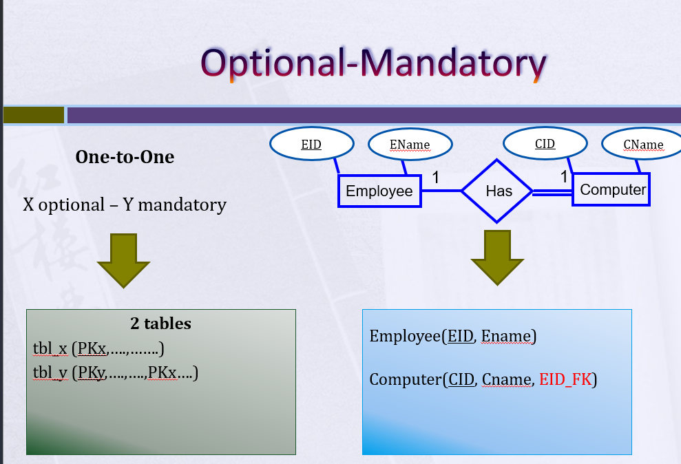
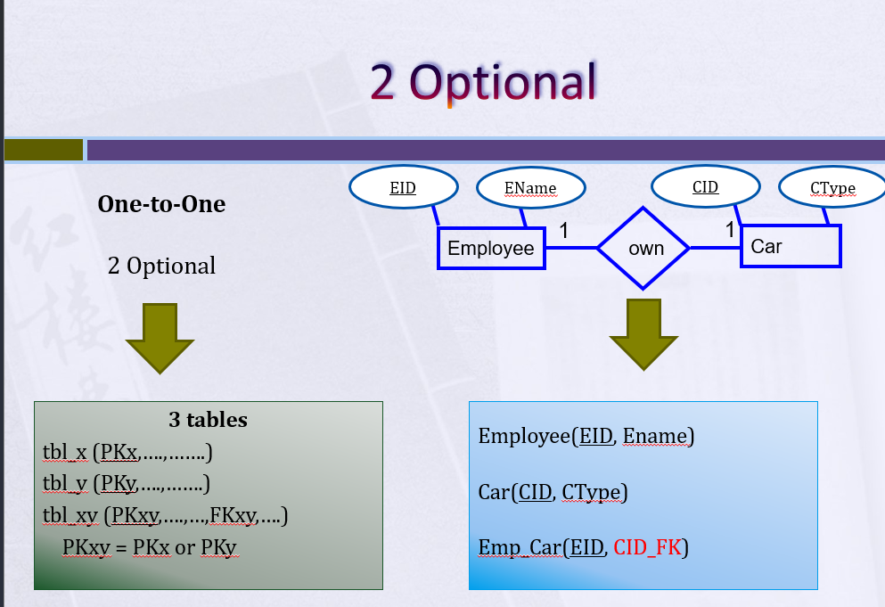

## Data Base
- **DB** is place to store and manage data in structured table with relationship with each other.
- **DBMS** (Database Management System) - software that manages the database, provides access control, transaction management, etc.
- **DB system** The DBMS software together with the data itself.the applications are also included. ( Software or dashboards + Database ). because the normal user can't deal with data base only the developer
- **schema**: is a named container for database objects. A schema can include tables, views, functions, stored procedures, and other database objects.The dbo schema is the default schema and is used to store objects that don't belong to a specific schema.
- **file system in sql server**:is consist of two files 1-mdf:it contains row data with its metadata(data about data) 2-ldf: log file contains all the transaction that i make on the ssms

******
## DB Design
- **DATA Modeling**: refer to how to organize data in database into tables and how to relate those tables if we want to join them.
- **ERD** : It is a <span style="background-color: green;">**visual representation**</span> used in database design to describe the logical structure of a database system Through converting **req document** needed from the customer into ERD. An ERD **illustrates the relationships between various entities (objects, concepts, or things) within a system and how they interact with each other**. Then we make <span style="background-color: green;">mapping</span> to convert it to actual schema table in our data base.  

**Entity type**
- **strong entity** : an Entity set that has a primary key.we can't say that the entity is a table as if there is entity with Multivalued Attribute it will be mapped as two tables.  

- **Weak entity**: An entity set that do not have sufficient attributes to form a primary key so it have partial key.it always be total Participation. تانيه يعنى لو عندى طفل لو مسحت الاب بتاعه مش هيبقى له معنى entity بيعتمد وجوده على  ( employ = his_family)


**attributes type**
- **Simple Attribute**
- **Composite Attribute** only i can say that composite if we add columns with each other it give me meaning like adress atrribute that have street and city  
- **Multi-valued Attribute** if we add columns with each other it didn't give me meaning like phone that have ph1 and ph2
- **Derived Attribute** it can be calculated based on another attribute like age ,it could be run on the runtime by making ispersisted (column property = no by default),or we can make it ispersisted=yes so he will save the calculated result in the hard disk.  
isparse=yes:if you want to make the null don't take space on the desk. 
- **Complex Attribute**


**relationship type**
- **degree** : unary(recursive,self join) , binary(two entity) , ternary(three entity or more) 
- **Cardinality** : التانيهentity مسكت صف واحد تشوف المدى بتاعه فى ( 1:1 , 1:M  M:M)    
- **Participation** : هل كل الصفوف داخله معانا فى العلاقه ولا لا . forien key allow null it make the relation partial participation , and if forien key don't allow null it make the relation total participation.

**Mapping**:
1-(total)1:1(total)     

2-(partial)1:1(total) participation, if the partial increase the number of table increase    
3-(partial)1:1(partial)           
4-(partial)1:m(total) i look at the many primary key will be from the many   
5-(partial)1:m(partial)     
6-m:m we put the shared attribute in the new table that contains the foriegn key    
7-ternary m:m    
**Candidate Key** A key is a column or set of columns in a table that uniquely identifies each row in that table. It helps in organizing and retrieving data efficiently. There can be multiple keys in a table, but typically, one of them is chosen as the primary key It is often the least number of columns of the keys and less data type.  

**Primary Key**  is a special type of key in a relational database. It **uniquely identifies each record (row)** in a table and ensures that there are no duplicate values in the primary key column(s). 
Key characteristics of a primary key:
1. Must contain unique values (no duplicates).
2. Cannot have NULL values (every row must have a value for the primary key).
3. Uniquely identifies each row in the table.

**Foreign Key** A foreign key is a column or a set of columns in a table that refers to the primary key of another table. <u>And it will be subset from the primary key</u>. It establishes a link between two tables, creating a relationship between them. The foreign key constraints ensure that the data in the foreign key column(s) of one table matches the data in the primary key column(s) of another table. This enforces referential integrity in the database.
Key characteristics of a foreign key:
1. It references the primary key of another table.
2. It helps maintain referential integrity, preventing orphaned records.
3. It can have NULL values, allowing for optional relationships (if specified as NULLable). + and can be duplicated.  

**ON UPDATE/ON delete >> NO ACTION the default behavior of the sql server ,The table that contain primary key is parent and the table that contain foreign key is child we can't remove  data from parent that have child.**  

**When you create a relationship between two tables, you can specify the actions that should occur when records in the referenced (parent) table are affected by an UPDATE or DELETE operation. These actions are defined through the ON UPDATE and ON DELETE clauses**  
1. **ON UPDATE CASCADE**:This option means that if a primary key value in the referenced table (parent) is updated, the corresponding foreign key values in the referencing table (child) will also be updated to match the new primary key value.  
```sql
CREATE TABLE ParentTable (
    ParentID INT PRIMARY KEY
);

CREATE TABLE ChildTable (
    ChildID INT PRIMARY KEY,
    ParentID INT FOREIGN KEY REFERENCES ParentTable(ParentID) ON UPDATE CASCADE
);
```
2. **ON UPDATE SET NULL**:This option means that if a primary key value in the referenced table is updated, the corresponding foreign key values in the referencing table will be set to NULL. This is useful when you want to allow records in the child table to exist independently of the referenced table.    
```sql
CREATE TABLE ParentTable (
    ParentID INT PRIMARY KEY
);

CREATE TABLE ChildTable (
    ChildID INT PRIMARY KEY,
    ParentID INT FOREIGN KEY REFERENCES ParentTable(ParentID) ON UPDATE SET NULL
);
```  
2. **ON UPDATE SET Default**:The SET DEFAULT option specifies that, if the referenced values in the parent table are updated or deleted, the related values in the child table with foreign key columns will be set to their default values1. The default value is the value that is assigned to the column when a new row is inserted and no value is specified for that column    
```sql
CREATE TABLE Products (
  ProductID int PRIMARY KEY,
  ProductName varchar(50) NOT NULL,
  Category varchar(20) DEFAULT 'Others' NOT NULL -- should make default value if you wnat to use  SET Default
);
INSERT INTO Products (ProductID, ProductName, Category)
VALUES
(1, 'Laptop', 'Electronics'),
(2, 'Book', 'Books'),
(3, 'Pen', 'Stationery');

CREATE TABLE Orders (
  OrderID int PRIMARY KEY,
  CustomerName varchar(50) NOT NULL,
  ProductID int FOREIGN KEY REFERENCES Products(ProductID) ON UPDATE SET DEFAULT ON DELETE SET DEFAULT
);

UPDATE Products
SET ProductID = 4
WHERE ProductID = 1;
```  
*****
## Normalization
- we use **Normalization** If we want to improve Data base system that already exist but we will use **ERD** if the data base system does not exist.  
 **Normalization** Normalization is a process used to organize and structure data within a database to **minimize redundancy and dependency issues**. The goal of normalization is to eliminate data anomalies and ensure data integrity by **breaking down large tables into smaller, related tables**. <u> I can say that my table Is correct when all column depend only on the primary key (there is no partial ( second form) and transitive ( third form ) dependency between columns) and (First form) there is no repeating group, multivalue and composite (seprate it into two columns or more) attribute  </u>.

 ****
 ## SQL

| DDL (Data Definition Lang) | DML (Data Manipulation lang) | DQL (Data Query lang) | TCL (Tansactionl Control Lang) | DCL (Data Control Lang) |
| -------- | -------- | -------- | -------- | -------- |
| Create, Alter, Drop, Select into | Insert, update, delete, merge | SELECT + agg fun, grouping join union subqery| begin transaction, commit, rollback | Grant, deny, Revoke |

char(2):static يعنى هيحجز 2 فى الميمورى لو حطيت واحد هياخدد اتنين بردو      
VARCHAR(24):variable يعنى هيحجز 24 فى الميمورى لو حطيت واحد هياخدد واحد بس
### DDL (meta data (information about information))
- **CREATE**
```sql
CREATE TABLE Persons (
    id INT IDENTITY(1,1) PRIMARY KEY,
    name VARCHAR(24)
);
```
**identity vs Sequence Object**  
**identity**: Use an Identity column when you need a unique, automatically incremented value for each row in a specific table. usualy used in primary key.  
**Sequence Object**: Sequence Object is a database object that generates a sequence of numerical values according to a defined pattern. It's essentially a generator of sequential numbers that can be used for various purposes within a database.  
1- Sequential Number Generation: A Sequence Object generates a sequence of numeric values in ascending or descending order, following a specified pattern.  
2- Defined Range and Increment: When creating a Sequence Object, you can specify the starting value, the increment value (how much to increase or decrease by), the minimum and maximum values, and whether the sequence should cycle or not (restart from the beginning after reaching the maximum or minimum value).  
3- Independence from Tables: Unlike auto-increment columns in tables, a Sequence Object is independent of any specific table. It generates sequential numbers separately from the data in the database and can be used across multiple tables or even databases.  
4-Usage Scenarios: Sequence Objects are handy when you need to generate unique identifiers for rows in a table, create a series of numbers for various purposes (such as invoice numbers, order numbers, or unique keys), or maintain a specific sequence for specific operations without relying on the data in a table.  

```sql
--Create Sequence Object 
Create SEQUENCE MySequence
START WITH 1
INCREMENT BY 1
MinValue 1
MaxValue 5
CYCLE; --default
-- you can reset you sequence easly
alter SEQUENCE MySequence
ReSTART WITH 1 --changed from start to restart
INCREMENT BY 1
CYCLE; --default  

drop SEQUENCE MySequence 

-- Create Temp Table the sequence can be used across multiple tables or even databases
create TABLE person1
(ID int,
FullName nvarchar(100) NOT NULL);

create TABLE person2
(ID int,
FullName nvarchar(100) NOT NULL);

INSERT into person1
VALUES (NEXT VALUE FOR MySequence, 'ahmed')

INSERT into person2
VALUES (NEXT VALUE FOR MySequence, 'ahmed1')
```

- **tables**  
**table variable** 
it run on the level of batch only (you should select it to get known with remained selected query )   
table variables don't affected by db transactions and Triggers  
```sql 
USE tempdb
go
CREATE TABLE test1 (id int)
go
DECLARE @test2 TABLE(id int)
BEGIN TRANSACTION
	INSERT INTO test1 VALUES(1)
	INSERT INTO @test2 VALUES(2)
ROLLBACK
	SELECT * FROM test1
	SELECT * FROM @test2
```
**global temp tables**
```sql
--2)
------shared by all users per server (session ends when all users that connect to server using this table disconnect from server )

create table ##share_table
(
sid int 
)
--droping
drop table ##share_table
```    
**local table (session based)**
```sql 
--until session ends when you disconnect from server
--use any database
create table #session
(
sid int
)
insert into #session values(1)
select * from #session
--droping
drop table #session
--Disconnecting server "end session"
```

-----
- **ALTER**
The ALTER statement is used to **modify the structure of database objects** such as tables, views, indexes, and more. **Add or remove columns**, **Modify the data type of columns**, A**dd or remove keys**, **Add or remove constraints**.
```sql
ALTER TABLE author
ADD telephone_number BIGINT; -- he add by default column

ALTER TABLE author
ALTER(Modify) COLUMN telephone_number CHAR(20);

ALTER TABLE author
DROP COLUMN telephone_number;
```
-----
- **DROP**
It delete the table can't rollback as it DDL **it Modify the structure of database objects**
```SQL
DROP TABLE <table name>;
```
-----
- **TRUNCATE**
The TRUNCATE statement is used to remove all rows from a table or Column, effectively resetting the table to its initial state(reset identity to its intial state from 1 not like delete statment)
TRUNCATE does not support a WHERE clause or the ability to delete specific rows based on a condition.
```sql
TRUNCATE TABLE author
IMMEDIATE;
```
-----
### DML 
- **INSERT**
```SQL
INSERT INTO AUTHOR (AUTHOR_ID, LASTNAME, FIRSTNAME, EMAIL, CITY, COUNTRY)
VALUES ('A1', 'Chong', 'Raul', 'rfc@ibm.com', 'Toronto', 'CA'),('A2', 'Chongg', 'Raulll', 'abc@ibm.com', 'torot', 'Ch');
```
**INSERT INTO SELECT:to copy only the schema from another table**
```SQL
iNSERT INTO new_student_table   -- it need the table to be created 
SELECT * FROM student;
WHERE 1 = 0;
`OR`
SELECT *
INTO new_student_table  -- into it will creat new table 
FROM student
WHERE 1 = 0;
```
 **BULK INSERT statement to insert data from a file into a table**
```sql
 BULK INSERT SampleTable
FROM 'C:\path\to\data.txt'
WITH (
    FIELDTERMINATOR = ',', --FIELDTERMINATOR: Specifies the field terminator that separates the fields in the data file (e.g., comma, tab, etc.)
    ROWTERMINATOR = '\n',  --Specifies the row terminator that separates the rows in the data file (e.g., newline character).
    FIRSTROW = 2,  -- Skip the first row if it contains headers
    MAXERRORS = 0  -- Maximum number of errors allowed
);
```
**INSERT bassed on execute**
```sql 
--insert bassed on execute
create proc GetStbyAge @agel int,@age2 int
AS
    select st_id,st_fname
    from Student
    where st_age betw een @agel and @age2

insert into tab4 (st_id, st_fname)
execute GetStbyAge 23, 28  -- you should write execute
```

----
- **UPDATE**
```SQL
UPDATE AUTHOR
SET LASTNAME = 'KATTA',
    FIRSTNAME = 'LAKSH'
WHERE AUTHOR_ID = 'A2';   مهمه جدا مع الUPDATA  , DELETEE    
```   
**delete the data in a specific column of a table without removing the column's schema**
```SQL
UPDATE student
SET address = NULL;
```
---
- **Delete**  
DELETE is a row-by-row operation and supports a WHERE clause to specify which rows to delete.  
DELETE can be rolled back within a transaction, while TRUNCATE cannot becuse it doesn't affect the structure of the table   
can't delete column using delete   
DELETE can fire triggers, while TRUNCATE usually doesn't.  
```sql
DELETE FROM AUTHOR
WHERE AUTHOR_ID IN ('A2', 'A3');  'or'
```
- **Merge** 
In SQL Server, the MERGE statement is a powerful SQL operation that allows you to perform multiple DML (Data Manipulation Language) operations—such as INSERT, UPDATE, and DELETE—on a **target table** in a single statement, based on the comparison of the data in the target table with a **source table** or subquery. It's also known as an "upsert" operation, as it combines INSERT and UPDATE actions.

```sql
Merge into Last Trasaction as T
Using Daily Transaction as S
On T.id = S.did

when Matched and S.dval>T.myvalues then   //1
update
Set T.myvalue=S.dval

When Not Matched by target then  //10 -- exist on source and not exist on target 
insert
values(S.did,S.dname,s.dval)

when not Matched by Source then //3,4 -- exist on target and not exist on source
Delete;
```
 Last transaction (target after edit)
 | Id | Name | myvalue |
| ---- | ----- | ------|
| 1 | ahmed |4000 -9000 |
| 2 | ali | 2000 |
| 3 | omar | 6000 |
| 4 | eman | 7000 |
|- 10 |- nada |- 3000 |

 Daily transaction (source)
 | Did | Dname | Dval |
| ---- | ----- | ------|
| 1 | ahmed |9000 |
| 2 | ali | 1000 |
|10 |nada |3000 |
---
### DQL
- Note: **where** filter on the rows it minimizes the number of **rows** but **having** filter on the group it minimize the number of the **groups** 
 ```SQL
 USE KxP_store; -- Open a specific database
--make new column and name it discount factor making this operation
SELECT DISTINCT last_name, first_name, points, (points + 10) * 100 AS "discount factor" --make new column and name it discount factor making this operation
FROM customers

WHERE state NOT IN ('VA' ,'GA', 'FL')                       --it is like OR
WHERE points BETWEEN 1000 AND 3000                          --it is like AND when it is one value, inclusive it is includes both 1000 and 3000
                                                                                         '--%mean any number of characters'
                                                                                         '_mean single character'--'b____y' it is like boagey
WHERE last_name LIKE 'aie%'                                    --'b%'  it gives name start with b --'%b%'  it gives name contain  b at any position
WHERE last_name LIKE '%[aei]e%'                              -- '%b'  it gives name end with b - 
WHERE last_name LIKE '%[a-h]e%'                              --'%[aei]e%' search ae,ee,ie  --'%[a-h]e%' search all range
WHERE last_name LIKE '%[^aei]e%'                                -- ^ it mean not will start with a or e or i
WHERE last_name LIKE '%[^a-h]e%'   
WHERE last_name LIKE '%[_]%'                                 -- it give Dina_abdallah
WHERE phone IS not NULL                                          -- we don't use = as null is not a value

ORDER BY first_name asc                                                    --ترتيب تنازلى من الاكبر  للاصغر  
ORDER BY first_name DESC  
ORDER BY statee , first_name                                          --هيرتب على حسب الاستيت عادى انما لو لقى متشابه هيرتب على حسب الاسم 
ORDER BY quantity * unit_price DESC
 ```   
 **You need to include ALL the columns that aren't in aggregate functions in your GROUP BY:**
 ```SQL
 select coun , count(country) as Count 
 from Author
 group by country
 having count (country) > 4
 ```
 OUTPUT 
 | Country | Count | 
| -------- | -------- |
| CN | 6 |
| IN | 6 |     

Write a query to print the hacker_id, name, and the total number of challenges created by each student. Sort your results by the total number of challenges in descending order. If more than one student created the same number of challenges, then sort the result by hacker_id. If more than one student created the same number of challenges and the count is less than the maximum number of challenges created, then exclude those students from the result.   
<div style="display: flex; justify-content: space-between;">

| hacker_id | name |
| --- | --- |
| 5077 | Rose |
| 21283 | Angela |
| 62743 | Frank |
| 88255 | Patrick |
| 96196 | Lisa |

| challenge_id | hacker_id |
| --- | --- |
| 61564 | 5077 |
| 85803 | 2183 |
| 40587 | 82855 |
| 1220 | 5077 |
| 29477 | 2183 |
| 65514 | 67243 |
| 48651 | 82855 |
| 58077 | 67243 |
| 18483 | 82855 |
| 76768 | 2183 |
| 52832 | 5077 |
| 74467 | 91986 |
| 33625 | 82855 |
| 26059 | 42685 |
| 12859 | 67243 |
| 70094 | 21855 |
| 34559 | 82855 |
| 54680 | 5077 |
| 61881 | 5077 |
</div>

```sql
SELECT c.hacker_id, h.name, COUNT(c.challenge_id) AS cnt 
FROM Hackers AS h 
INNER JOIN Challenges AS c 
    ON h.hacker_id = c.hacker_id
GROUP BY c.hacker_id, h.name 

-- Calculating Maximum challenges
HAVING COUNT(c.challenge_id) = (SELECT MAX(number_of_challenges)
                                 FROM (SELECT c1.hacker_id, COUNT(c1.challenge_id) AS number_of_challenges
                                      FROM Challenges AS c1
                                      GROUP BY c1.hacker_id) AS challenge_counts)  
            OR
-- Number of challenges which are not equal to maximum challenges are excluded
COUNT(c.challenge_id) NOT IN (SELECT COUNT(c2.challenge_id) 
                              FROM Challenges AS c2 
                              GROUP BY c2.hacker_id 
                              HAVING c2.hacker_id <> c.hacker_id)

ORDER BY cnt DESC, c.hacker_id;

--another solution 
with cte as(select c.hacker_id,name,count(*) total_challenge
from challenges c
join hackers h on h.hacker_id=c.hacker_id
group by c.hacker_id,name)

,cte1 as(
select total_challenge,count(*) total,dense_rank() over(order by total_challenge desc) ranking
from cte 
group by total_challenge)

select hacker_id,name,cte.total_challenge
from cte
join cte1 on cte.total_challenge=cte1.total_challenge
where total=1 or ranking=1
order by cte.total_challenge desc,hacker_id
```

---
    

- **join**  
**Inner Join**: Returns only the rows where there is a match in both tables.  
**Left outer Join**: Returns all the rows from the left table and matching rows from the right table.when he ask to return all the values from left table Regardless of whether there are corresponding values or not.   
**Right outer Join**: Returns all the rows from the right table and matching rows from the left table.  
**right anti join**: returns the rows from the right table that are not in the left table.  
**left anti join**: returns the rows from the left table that are not in the right table.  
**Full Outer Join**: Returns all the rows from both tables, including those where there is no match in either table.  
**Cross Join**: Returns all possible combinations of rows from both tables.

````sql
Select order_id, c.customer_id, first_name    --select specific column
FROM orders o   -- the table comes after from and come first will be left table 
JOIN customers c -- the table comes after Join and come second will be Right table 
ON o.customer_id = c.customer_id
-- we Write the table name because the two column have the same name
````
**joining two tables that didn't have relation (primary and foreign key)**  
<div style="display: flex; justify-content: space-between;">

| ID | Name     | Marks |
|----|----------|-------|
| 1  | Julia    | 88    |
| 2  | Samantha | 68    |
| 3  | Maria    | 99    |
| 4  | Scarlet  | 78    |
| 5  | Ashley   | 63    |
| 6  | Jane     | 81    |

| Grade | Min_Mark | Max_Mark |
|-------|----------|----------|
| 1     | 0        | 9        |
| 2     | 10       | 19       |
| 3     | 20       | 29       |
| 4     | 30       | 39       |
| 5     | 40       | 49       |
| 6     | 50       | 59       |
| 7     | 60       | 69       |
| 8     | 70       | 79       |
| 9     | 80       | 89       |
| 10    | 90       | 100      |

</div>

```sql 
SELECT CASE WHEN g.Grade >= 8 THEN s.Name END AS Name, g.Grade , s.Marks
FROM students s 
JOIN grades g ON s.Marks BETWEEN g.Min_Mark AND g.Max_Mark   --- Nested loop join : it loop on all compination 
WHERE g.Grade IS NOT NULL 
ORDER BY g.Grade DESC, s.Name;

--my soultion
select case when gr>=8 then Name end,
gr,marks  
from (select  Name ,
 case when Marks between Min_Mark and Max_Mark then Grade end as gr,
 Marks
from grades ,students) as tb1
where gr is not null 
order by gr desc, Name
```   
Write a query to output the names of those students whose best friends got offered a higher salary than them. Names must be ordered by the salary amount offered to the best friends. It is guaranteed that no two students got same salary offer.  
<div style="display: flex; justify-content: space-between;">

| ID | Friend_ID |
| --- | --- |
| 1 | 2 |
| 2 | 3 |
| 3 | 4 |
| 4 | 1 |

| ID | Salary |
| --- | --- |
| 1 | 15.20 |
| 2 | 10.06 |
| 3 | 11.55 |
| 4 | 12.12 |

| hacker_id | name |
| --- | --- |
| 5077 | Rose |
| 21283 | Angela |
| 62743 | Frank |
| 88255 | Patrick |
| 96196 | Lisa |
</div>
output>>    
Samantha  
Julia  
Scarlet  

```sql 
select s.name from students s 
inner join packages p on s.id = p.id
inner join friends f on s.id=f.id
inner join packages fp on f.friend_id= fp.id
where fp.salary > p.salary
order by fp.salary;
--OR 
SELECTB S_NAME
FROM
    (
        SELECT
            STU.ID AS S_ID,
            STU.NAME AS S_NAME,
            PCK.SALARY AS S_SAL,
            FDS.FRIEND_ID AS F_ID
        FROM
            STUDENTS AS STU
            JOIN PACKAGES AS PCK ON PCK.ID = STU.ID
            JOIN FRIENDS AS FDS ON STU.ID = FDS.ID
    ) AS LV1
    JOIN (
        SELECT
            STUDENTS.ID S2_ID,
            STUDENTS.NAME F_NAME,
            PACKAGES.SALARY F_SAL
        FROM
            STUDENTS
            JOIN PACKAGES ON STUDENTS.ID = PACKAGES.ID
    ) AS LV2 ON LV1.F_ID = LV2.S2_ID
WHERE F_SAL > S_SAL
ORDER BY F_SAL
``` 
- **UNION**
The SELECT statements must have **the same number of columns**, and the corresponding columns in each SELECT statement must have **compatible data types**.  
UNION and UNION ALL are useful operators in SQL Server for combining the results of two or more SELECT statements into a single result set, with the main difference being that UNION removes duplicates and also sorts data while UNION ALL does not.
```SQL
SELECT column1, column2, ... FROM table1
UNION
SELECT column1, column2, ... FROM table2;

SELECT column1, column2, ... FROM table1
UNION ALL
SELECT column1, column2, ... FROM table2;
```
-----
- **CASE WHEN** > is used for assigning values to columns or variables based on conditions in a result set.
-- is used in queries to transform or manipulate data  
it works on a row-by-row basis. It is a conditional expression that evaluates a set of conditions and returns a result based on the first condition that is true. The CASE statement can be used in various contexts, including within a SELECT statement, in the SET clause of an UPDATE statement, or in the ORDER BY clause.
```SQL
SELECT
    column1,
    column2,
    CASE
        WHEN condition1 THEN result1
        WHEN condition2 THEN result2
        ...
        ELSE default_result
    END AS result_column
FROM
    your_table;


SELECT quantity_in_stock,
CASE 
    WHEN quantity_in_stock > 67 THEN 'Large'
    WHEN quantity_in_stock < 67 THEN 'Small'
END AS new_column
FROM products;
```
----
## **Subquery**   

| Type of Subquery | Description | Example |
| --- | --- | --- |
| Scalar subquery | Returns a single value. | SELECT COUNT(*) FROM employees WHERE salary > (SELECT AVG(salary) FROM employees) |
| Multi-row subquery | Returns multiple rows of results. And single column | SELECT column1, column2 FROM main_table WHERE column3 IN (SELECT column3 FROM sub_table WHERE condition);|
| Multiple column subquery | This type of subquery returns one or more rows and one or more columns. to use > or > we should use any or all and to know the equalitly use IN | SELECT column1, column2 FROM main_table WHERE column3 IN (SELECT sub_column FROM sub_table WHERE condition);<br> SELECT column1, column2 FROM main_table WHERE column3 > ANY (SELECT sub_column FROM sub_table WHERE condition); <br> SELECT column1, column2 FROM main_table WHERE column3 > ALL (SELECT sub_column FROM sub_table WHERE condition); |
| **Correlated subquery** (CROSS join APPLY) | Evaluated once for each row of the outer query. | SELECT * FROM employees WHERE salary > (SELECT salary FROM employees WHERE manager_id = employee_id) |
| Nested subquery | A subquery that is nested inside another subquery | SELECT * FROM employees WHERE salary > (SELECT MAX(salary) FROM employees WHERE department_id = 'HR')

This subquery checks if there are any rows in the "Projects" table where the End_Date matches the Start_Date of the outer query's current row (P1.Start_Date). This subquery will be evaluated for each row in the outer query's result set. **Not exists** return true If there's no row in the subquery result so it return start date that isn't in end date.

```sql
SELECT ROW_NUMBER() OVER (ORDER BY P1.Start_Date ASC) AS 'ord', P1.Start_Date
        FROM Projects P1
        WHERE EXISTS (SELECT * from Projects P2 WHERE P2.End_Date = P1.Start_Date)
```    
----
## **window function**    
is a type of function that performs a calculation across a set of rows, called a window, within the result set of a query. The window function returns a value for each row in the result set, based on the values in the window.يعنى بياخد الجدول كوبى يعمل العمليه الحسابيه على الويندو مش على الجدول الاصلى والناتج بينضاف للجدول الاصلى من غير ماتغير فى الصفوف فى الجدول الاصلى زى مابيعمل الجروب باى الى بيعمل summarize كدا   
SQL Server supports several types of window functions, including:  
    1. Ranking functions, such as ROW_NUMBER(), RANK(), and DENSE_RANK(), which assign a rank or row number to each row in the window based on the values in one or more columns.  
    2. Aggregate functions, such as SUM(), AVG(), MIN(), and MAX(), which calculate an aggregate value over the rows in the window.  
    3. Analytic functions, such as LAG(), LEAD(),NTILE() and FIRST_VALUE(), which return a value based on the value in the current row and the values in the preceding or following rows.   

بتقسم الجدول ل اجزاء وتشتغل علي كل جزء لوحده   
In SQL Server, the **PARTITION BY** clause is used in connected with the OVER clause to divide a result set into partitions and perform aggregate calculations on each partition separately.
The PARTITION BY clause is a powerful tool in SQL Server that allows you to perform calculations on subsets of data within a larger result set.It is commonly used with window functions to perform running totals, ranking,and other aggregate calculations.  

**This query give the employee that take highest salary for every department**  
```sql
WITH RankedEmployees AS (
  SELECT EmpID, EmpName, Department, EmpSalary,
         RANK() OVER (PARTITION BY Department ORDER BY EmpSalary DESC) AS EmpSalaryRank 
  FROM tblEmployee
SELECT EmpID, EmpName, Department, EmpSalary
FROM RankedEmployees
WHERE EmpSalaryRank = 1  )
 ```        
**we can use select from select(subqueries) instead of CTEs**
```sql
select * from
( select EmpID ,EmpName ,Department ,EmpSalary 
,rank() over(partition by Department order by EmpSalary desc) as EmpSalaryRank 
FROM [tblEmployee] )  tb1 
where EmpSalaryRank = 1
```
-----
## CTEs,tables, Stored procedures, Function , Views
- **CTEs**   
 CTEs(veiw in memory) stands for Common Table Expressions, which is a temporary result set that is defined within the execution of a single SQL statement. In other words, CTEs allow you to create a named query that can be referenced multiple times within the same SQL statement.CTEs are not functions in the sense that they do not take input parameters or return values, and they do not encapsulate a block of code that can be called from different parts of your code.  
 CTEs allow you to **simplify complex queries** by breaking them down into smaller, more manageable readable and maintainable. And increase the performance.
```sql
 WITH my_cte AS (
    SELECT column1, column2, ...
    FROM my_table
    WHERE condition)
,my_cte2 AS ()

SELECT *
FROM my_cte
WHERE column1 > 100;

--ctes is like view Memory 
-- this example of self join
with Cte 
as
(
 select * from student
)
select S1.st_fname,S2.*
from Cte S1 ,Cte S2
where S2.st_id=S1.St_super

-- examples on recrcsive cte it call itself on it
CREATE VIEW [vw_DIM|Status]
AS
WITH CTE 
AS
(
SELECT 1 [StatusId], [dbo].[ufnGetSalesOrderStatusText](1) [StatusName]  -- this called query that run in the first
UNION ALL
SELECT [StatusId] + 1, [dbo].[ufnGetSهحاول اشرح فى البوست ده الrecrcieve Common Table Epression [CTE] 
alesOrderStatusText]([StatusId] + 1) [StatusName]
FROM CTE                                                                                    --recrusive part of the query
WHERE [StatusId] < 6
)
SELECT [StatusId], [StatusName]
FROM CTE


```

To make the code more secure you should  make any code that will executed from the data base must be either a **procedures** or a **function**.  
**Functions** are useful for encapsulating **calculations**, transformations, or lookups that need to be used in various SQL queries.  
-It can be used in where or select statement to be part of this statement.       
-**Function** can't contain any dml(insert, update, delete) **only contain select select statment and insert in new table variable not table in our database**  


- **function**  
**scalar funcion** --> return one vales  
**note:** we can't use **try , catch** in the body of the function. and we can't write **excecute** as it dynamic query we can use it in s.procedures  
```sql

/* 4.Create a scalar function that takes Student ID and returns a message to user 
a.	If first name and Last name are null then display 'First name & last name are null'
b.	If First name is null then display 'first name is null'
c.	If Last name is null then display 'last name is null'
d.	Else display 'First name & last name are not null'

note that any variable by default is null  so it will return null if we entered id that isn't in our table
*/
CREATE FUNCTION CheckStudentName(@StudentID INT)
RETURNS NVARCHAR(100)
AS
BEGIN
    DECLARE @Message NVARCHAR(100)

    IF EXISTS (SELECT 1 FROM dbo.Student WHERE St_Id = @StudentID)
    BEGIN
        SELECT
            @Message = CASE
                WHEN St_Fname IS NULL AND St_Lname IS NULL THEN 'First name & last name are null'
                WHEN St_Fname IS NULL THEN 'First name is null'
                WHEN St_Lname IS NULL THEN 'Last name is null'
                ELSE 'First name & last name are not null'
            END
        FROM
            dbo.Student
        WHERE
            St_Id = @StudentID;
    END
    ELSE
    BEGIN
        SET @Message = 'Student ID does not exist';
    END

    RETURN @Message;
END;
SELECT dbo.CheckStudentName(1) AS 'Message'; -- you should write schema as sql server don't consider it as builtin function 
```
**Inline table function** --> return table only contain select like view  
return table as a result of select statment  
```sql
--5 Create inline function that takes integer which represents manager ID and displays department name, Manager Name and hiring date 
CREATE FUNCTION GetManagerInfo( @ManagerID INT)
RETURNS TABLE
AS
RETURN
(
    SELECT
        d.Dept_Name , i.Ins_Name ,d.Manager_hiredate
    FROM dbo.Instructor i
    JOIN dbo.Department d ON i.Dept_Id = d.Dept_Id
    WHERE i.Ins_Id = @ManagerID
);

SELECT * FROM dbo.GetManagerInfo(1);
```
**multi_statment table-valued function** --> if select contain any logic like if, declare, while  
return a new table as a result of insert statment   
```sql
/* 6.	Create multi-statements table-valued function that takes a string
If string='first name' returns student first name
If string='last name' returns student last name 
If string='full name' returns Full Name from student table 
Note: Use “ISNULL” function
مهمتك تملى الجدول ده بالكود
*/

ALTER FUNCTION GetStudentInfo(@ColumnInfo NVARCHAR(50))
RETURNS @ResultTable TABLE
(
    ResultValue NVARCHAR(100)
)
AS
BEGIN
    IF @ColumnInfo = 'first name'
    BEGIN
        INSERT INTO @ResultTable (ResultValue)
        SELECT ISNULL(St_Fname, '') FROM dbo.Student;
    END
    ELSE IF @ColumnInfo = 'last name'
    BEGIN
        INSERT INTO @ResultTable (ResultValue)
        SELECT ISNULL(St_Lname, '') FROM dbo.Student;
    END
    ELSE IF @ColumnInfo = 'full name'
    BEGIN
        INSERT INTO @ResultTable (ResultValue)
        SELECT ISNULL(CONCAT(St_Fname, ' ', St_Lname), '') FROM dbo.Student;
    END
    ELSE
    BEGIN
        INSERT INTO @ResultTable (ResultValue)
        SELECT 'Invalid column info please enter those (full name,last name,first name)';
    END

    RETURN; -- you don't need to write table name he automaticly will return to the table
END;

SELECT * FROM dbo.GetStudentInfo('first name');
```

- **Stored procedures**   
**Stored procedures** can be reused across different parts of your application, reducing code duplication. To deal with our **data base**.
--Can write all query type DDL , DML , insert , update delete.  
-- have **more performance** on the **network traffic**(have less character while sending as a call ) and **our engine** (it stored so we don't need make all cycle of execution plane again )  
-- secure because I can hide business role inside it.  
-- catch error before happen in the data base .  
-- **return**:It's not mandatory to return a value like function. it can **return** integer (number) but this number have meaning or tell us the behaviour of the SP for the database developer or application programmer.  
```sql
create proc getalldata @col varchar(20) ,@tab varchar(20)
As 
execute('select' + @col+ 'from' + @tab)   -- to make dynamic query we use execute

--mysql
DELIMITER //       --DELIMITER //: This sets the delimiter to // so that we can use ; within the procedure definition without causing issues.
CREATE PROCEDURE GetEmployeeByDepartment(IN departmentName VARCHAR(50))
BEGIN
    SELECT emp_id, emp_name
    FROM employees
    WHERE department = departmentName;
END//
DELIMITER ;

CALL GetEmployeeByDepartment('Sales');
```
**types of SP parameter** 
Stored procedures in a database can have different types of parameters, and these parameters allow you to pass values into the stored procedure when it is called. Let's explore the common types of stored procedure parameters in simple terms:

### 1. **Input Parameters:**

**Definition:**
- **Input parameters** allow you to pass values into a stored procedure when you call it.
- These values are used within the stored procedure but are not modified by it.

**Example:**
```sql
CREATE PROCEDURE GetCustomerInfo
    @CustomerID INT  -- @CustomerID is an input parameter
AS
BEGIN
    SELECT * FROM Customers WHERE CustomerID = @CustomerID;
END;
```

### 2. **Output Parameters:**

**Definition:**
- **Output parameters** are used to return values from a stored procedure back to the calling program.
- The stored procedure can modify the values of these parameters.

**Example:**
```sql
CREATE PROCEDURE GetNextOrderID
    @NextOrderID INT OUTPUT  -- @NextOrderID is an output parameter
AS
BEGIN
    SELECT @NextOrderID = MAX(OrderID) + 1 FROM Orders;
END;
```

### 3. **Input/Output Parameters:**

**Definition:**
- **Input/Output parameters** serve a dual purpose—they allow you to pass values into a stored procedure and also return modified values.

**Example:**
```sql
CREATE PROCEDURE UpdateCustomerBalance
    @CustomerID INT,
    @AmountToAdd DECIMAL(10, 2) OUTPUT  -- @AmountToAdd is an input/output parameter
AS
BEGIN
    -- Add the specified amount to the customer's balance
    UPDATE Customers SET Balance = Balance + @AmountToAdd WHERE CustomerID = @CustomerID;
    
    -- Return the updated balance through the output parameter
    SELECT @AmountToAdd = Balance FROM Customers WHERE CustomerID = @CustomerID;
END;
```

### 4. **Default Parameters:**

**Definition:**
- **Default parameters** have default values assigned to them.
- If a value is not explicitly provided when calling the stored procedure, the default value is used.

**Example:**
```sql
CREATE PROCEDURE GetOrdersByStatus
    @Status VARCHAR(20) = 'Pending'  -- @Status is a default parameter
AS
BEGIN
    SELECT * FROM Orders WHERE OrderStatus = @Status;
END;
```

### 5. **Table-Valued Parameters:**

**Definition:**
- **Table-valued parameters** allow you to pass a table structure as a parameter to a stored procedure.
- Useful when you want to pass multiple rows of data.

**Example:**
```sql
CREATE TYPE dbo.EmployeeTableType AS TABLE
(
    EmployeeID INT,
    EmployeeName NVARCHAR(50),
    -- Other columns...
);

CREATE PROCEDURE InsertEmployees
    @Employees dbo.EmployeeTableType READONLY  -- @Employees is a table-valued parameter
AS
BEGIN
    INSERT INTO Employees (EmployeeID, EmployeeName)
    SELECT EmployeeID, EmployeeName FROM @Employees;
END;
```

- **Views**  
**Views** are **virtual tables** that are derived from the result of a SELECT query. It does not physically store the data itself; instead, it's a **saved SQL query** If the underlying data in the tables changes, the view reflects those changes immediately. They are used to simplify complex queries, encapsulate logic, and **provide an abstraction layer over the underlying tables**.   
Views are generally read-only and used for data retrieval. You cannot directly perform data manipulation operations (e.g., UPDATE, DELETE) on a view unless it's an "updatable" view based on certain conditions. <u>could make insert and update if the other column that isn't in the view allow null value and we couldn't delete from view</u>.  
--View increase security not performance.
```sql
CREATE VIEW view_name(col1,col2,..)--to make alis name for the column 
AS
SELECT column1, column2, ...
FROM some_table
WHERE condition;
With check option       -- it make constrain it will check where condition before insert or update  

SELECT *
FROM view_name
WHERE some_column = some_value;
```
----
## DCL

The **GRANT** statement is used to provide specific privileges or permissions to users or roles. These privileges can include the ability to execute certain SQL statements (e.g., SELECT, INSERT, UPDATE, DELETE) on specific database objects (e.g., tables, views) or even the ability to create or drop objects.
**Grant SELECT permission on the "employees" table to a user named "john"**
```sql
Grant SELECT permission on the "employees" table to a user named "john";
Grant ALL permission on the "employees" table to a user named "john" with grant option ; --IF you want to give all (select, insert, update , delete)  to this user 
```
----
**REVOKE**: The REVOKE statement is used to remove previously granted privileges from users or roles.
**Revoke the SELECT permission on the "employees" table from the user "john"**
```sql
Revoke the SELECT permission on the "employees" table from the user "john"
```
-----
## index
The table stored on the desc as Data Pages(4k-8k) it stored row by row in every page 
Index : It solve the problem of **whole table scan** ,by using it You don't have to scan the whole table, you will **scan page** instead when using index ,so the data access faster and optimized. I make index on the column that i expect they will search on it too much to make the searching process faster .
Examples for index : **Clustered-index**  , **non-clustered-index**

**Clustered Index:** In a clustered index, the actual data rows of the table are **physically stored** in the order of the indexed column(s). There can be only one clustered index per table, as the data rows are physically rearranged to match the index order.it will build **binary tree** on the pk it will start with root page and then redirection until reach the data page

**Non-clustered Index:** A non-clustered index consists of a separate data structure that holds a **copy** of the indexed columns along with a **pointer** to the corresponding rows in the actual data pages. A table can have multiple non-clustered indexes.  

**Disadvantage** of index :indexes can also **slow down** data modification operations (INSERT, UPDATE, DELETE) for several reasons.  
Overhead: Maintaining an index requires a**dditional storage space** and computing power. Every time data is inserted, updated, or deleted, the index **needs to be updated** to reflect these changes. This adds overhead to these operations. 

-----
## order of execution

1. **FROM**: This is where the data sources are specified, including tables, views, or derived tables.

2. **JOIN**: If there are any join operations, they are processed at this stage to combine data from multiple sources.

3. **WHERE**: The conditions specified in the WHERE clause are applied to filter the rows.

4. **GROUP BY**: If a GROUP BY clause is present, the data is grouped according to the specified columns.

5. **HAVING**: The HAVING clause is used to filter the grouped data.

6. **SELECT**: The columns specified in the SELECT clause are retrieved from the processed and filtered data.

7. **DISTINCT**: If the DISTINCT keyword is used, duplicate rows are removed from the result set.[aggregation]

8. **ORDER BY**: If an ORDER BY clause is present, the result set is sorted according to the specified columns.

9. **TOP/LIMIT**: If using TOP in SQL Server or LIMIT in some other databases, the query will return only a specified number of rows.

Additionally, subqueries, common table expressions (CTEs), and window functions can complicate the order of execution, as they might introduce separate phases or modify the processing sequence.

**This query will give error because the where executed before the select so it didn't see the alias name fullname.**
```sql 
select st fname+' '+St Iname as fullname
From Student
where fullname= 'ahmed ali'
-- You can make it as bellow the sub-query will execute first so it will see the fullname in the where statment
select *
from (select st_fname+' '+St Iname as fullname
          from Student) as Newtable
where fullname='ahmed ali '
```


-----
**XML**, on the other hand, does not have predefined tags like html and allows users to define their own tags based on their specific requirements. This flexibility makes XML more suitable for representing complex data structures.    

**XML** is **platform-independent** and can be used to **exchange data** between systems with different architectures (SQL server, Oracle, MySQL). It's widely supported in various programming languages and technologies. We can convert table to xml (for xml) or  xml to table (open xml)  

----
## ACID
ACID Is transaction proparity 
-- **Atomicity**   All changes to data are performed as if they are a single operation. That is, all the changes are performed, or none of them are.    
-- **Consistency** constrain active, Data is in a consistent state when a transaction starts and when it ends    
-- **Isolation** - locks, The intermediate state of a transaction is invisible to other transactions. As a result, transactions that run concurrently appear to be serialized.  
-- **Durability** - rollback,   After a transaction successfully completes, changes to data persist and are not undone, even in the event of a system failure.  

```sql
--try and catch  with transaction 

create table parent
(
pid int primary key not null
)
create table child
(
cid int references parent(pid)
)
insert into parent values(1)
insert into parent values(2)
insert into parent values(3)
insert into parent values(4)

begin try
	begin tran
		insert into child values(1)
		insert into child values(5)
		insert into child values(2)
	commit tran
	print 'transaction commited'
end try
begin catch
	rollback
	print 'transation rolled back'
	select error_number() as "number",
	error_message() as "message",
	error_line() as "line"
end catch
```
------
## Constrain VS Rule

**Constrain** created on the level of tables.It is a rule or condition applied to a set of columns in a table to maintain the integrity, accuracy, and consistency of the data stored in the databasecommon types of constraints in SQL Server:
Primary Key Constraint,Foreign Key Constraint, Unique Constraint (allow one null value),Check Constraint, Default Constraint.  
1- Can't be shared.   
2- Applied on all data not on the new data only.   
3- Can make multiple of constrain.   

```sql
 CREATE TABLE Students (    
StudentID INT PRIMARY KEY,
StudentName VARCHAR(50), 
OrderID INT PRIMARY KEY,
CustomerID INT FOREIGN KEY REFERENCES 
Customers(CustomerID),
OrderDate DATE,
EmployeeID INT UNIQUE, 
Price DECIMAL(10, 2) CHECK (Price >= 0)
Content VARCHAR(255) DEFAULT 'No content');
```

    
**Rule** created on the level of database.  
	1- Can be shared.  
	2- Applied on the new data only.  
	3- Can't make multiple rule on one column.as the columm have one data type and we add this rule on that column.  
	4- Can create new data type.  
```sql
CREATE RULE CheckAgeAS @Age >= 18 AND @Age <= 100
sp_bindrule 'CheckAge', 'Employees.Age'
sp_unbindrule 'CheckAge', 'Employees.Age'  -- to delte the rule you should unbind it 
drop rule CheckAgeAS                       -- delete it 

--creating data type 
create rule rl @x > 1000
create default defl as 5000
sp_addtype ComplexDT, ' int'
sp_bindrule rl, ComplexDT
sp_bindefault defl, ComplexDT

create table test3(
    id int,
name varchar(20),
salary ComplexDT)
``` 
------
## trigger
trigger is a **special type of stored procedure** that automatically executes in response to a specific event or action that occurs within the database.   

**DML** Triggers (Data Modification Language Triggers): at the level of tables   

**AFTER(FOR)** Triggers: These triggers fire automatically after a specified event (e.g., INSERT, UPDATE, DELETE) occurs. They are commonly used for auditingعلشان اعرف مين الى كان عاوز يعدل مش مجرد بيمنع بس , logging changes, and enforcing data integrity constraints.   

**INSTEAD OF** Triggers: These triggers fire instead of the original data modification operation. They are typically used with views to enable data modifications on views that would otherwise be read-only. 

**DDL** Triggers (Data Definition Language Triggers): at the level of database   
These triggers respond to data definition language events, such as CREATE, ALTER, or DROP statements for tables, views, or stored procedures. They are often used to enforce security policies, track schema changes, or prevent certain database actions.   
``` sql
 create trigger t5 
on course 
after update 
As
Select *  from inserted 
Select *   from deleted 

Update course 
    set crs_name= 'Cloud' ,crs_duration=45 
where crs_id=l00 
```
 
deleted Table: it contains the rows that were just deleted 
| Crs_id  | Crs_name  | Crs_duration  | top_id |
|-------|----------|----------|--------|
| 100   | HTML   | 20   |  3     | 

inserted Table: it holds the rows that were just inserted.   

| Crs_id  | Crs_name  | Crs_duration  | top_id |
|-------|----------|----------|--------|
| 100   | cloud    | 45   |  3     | 

```sql
 --6 you can't write rollback with instead of 

Alter TRIGGER PreventEmployeeInsert
ON Employee
AFTER INSERT
AS
BEGIN    
     IF EXISTS ( SELECT 1 FROM INSERTED WHERE MONTH(Bdate) = 3 )
    BEGIN
		SELECT 'Insertion into Employee table is not allowed in March.'
		ROLLBACK
    END
    ELSE
    BEGIN
        -- Insert the records as normal
        INSERT INTO Employee 
        SELECT * FROM INSERTED;
    END
END;

INSERT INTO Employee (Fname, Lname, SSN, Bdate, Address, Sex, Salary)
VALUES ('ali', 'mon', 671726665, '1980-03-15', '123 Main St', 'M', 50000);
```
-------
## cursor
In SQL Server, a cursor used to retrieve and manipulate data row by row from a result set. Think of it as a pointer or a mechanism to navigate through a set of data returned by a query.  

When you execute a SELECT statement in SQL Server, it often returns a collection of rows known as a result set. A cursor allows you to move through this result set row by row, perform operations on each row individually, and process the data sequentially.  

Here's a simple breakdown:  

1- **Declare Cursor**: First, you declare and define a cursor using a SQL query.  
2- **Declare variables** : to assign values it is often the same number of values that returned from the query.     
3- **Opening the Cursor**:it pace pointer at first row. After declaring, you open the cursor, which executes the specified query and creates a result set.   
4-**Fetching Rows**: You can fetch rows from the result set one by one or in batches. This allows you to perform operations on each row, like updating values, deleting, or processing the data.
6-**@@FETCH_STATUS**:to check the status of a cursor operation after a fetch operation. The @@FETCH_STATUS variable returns an integer value that reflects the status of the fetch operation. 0(FETCH_SUCCESS): Indicates that the fetch operation was successful,1(FETCH_ERROR): Indicates that the fetch operation failed,2(FETCH_NO_DATA): Indicates that there was no more data to fetch.    
5-**Processing**: Once you've fetched a row, you can work with its data before moving on to the next row.  
**Closing the Cursor**: save pointer and you can make another thing and return open the cursor  
**Deallocate the Cursor**: After processing all the rows, you close the cursor to release the associated resources and free up memory.  
```sql
declare c1 cursor
for select salary from Instructor
for update
declare @sal int
open c1
fetch c1 into @sal
while @@FETCH_STATUS=0
	begin
		if @sal>=3000
			update Instructor	
				set salary=@sal*1.20
			where current of c1
		else if @sal<3000
			update Instructor
				set salary=@sal*1.10
			where current of c1
		else
			delete from Instructor
			where current of c1
		fetch c1 into @sal
	end
close c1
deallocate c1
```


-------
## Optimization query
  ### database statistic 

table statistics in a relational database, such as SQL Server, provide information about the distribution of data within a table. These statistics help the query optimizer make informed decisions when creating execution plans for queries. Let's break it down:

### 1. What are Table Statistics?

**Definition:**
- **Table Statistics** are metadata about the data distribution in a table.
- They include information about the number of rows, the distribution of values in columns, and other relevant data characteristics.so the optmizer make Cardinality estimation cost based on those tables statistics.  

### 2. Why are Table Statistics Important?

**Query Optimization:**
- When you submit a query to the database, the query optimizer's job is to figure out the most efficient way to retrieve or modify the data.
- Understanding the distribution of data helps the optimizer make smart decisions about how to access and process the information.

**Example:**
- Let's say you have a column in a table with mostly unique values, like customer IDs. If the optimizer knows this, it might choose a different execution plan than if the column had many duplicate values.

### 3. How are Table Statistics Generated?

**Automatic and Manual:**
- **Automatic:** In many databases, including SQL Server, statistics are automatically created and updated by the database engine. This happens during certain database operations, like when indexes are created or data is modified.
- **Manual:** In some cases, you might manually update statistics to ensure they are up-to-date, especially if your data distribution changes significantly.

**Statistics Types:**
- **Column Statistics:** Provide information about the distribution of values in a specific column.
- **Index Statistics:** Include information about the distribution of keys in an index.

### 4. How to View and Update Table Statistics?

**Viewing Statistics:**
- You can query system views or use database management tools to view statistics information. In SQL Server, you might look at the `sys.stats` view.

**Updating Statistics:**
- Statistics are usually updated automatically, but you can manually update them using a command like `UPDATE STATISTICS`.
  

### 5. Importance of Up-to-Date Statistics:

**Accurate Decisions:**
- Keeping statistics up-to-date ensures that the optimizer has accurate information to make decisions.
- Outdated statistics might lead to suboptimal query plans.

**Example:**
- If the data distribution changes significantly, the optimizer might make better decisions with updated statistics. For instance, if a column that used to have mostly unique values starts having many duplicates, the optimizer needs to be aware of this change.

In summary, table statistics are a crucial part of the database's optimization process. They provide insights into the data distribution, helping the query optimizer make intelligent choices for executing queries in the most efficient way.

## Optimization 

 **Optimizing** a query in SQL Server involves various techniques and strategies to improve Qyery performance.The query optimizer's goal is to minimize the cost of executing the query while considering various factors, and it achieves this by exploring and selecting the most efficient logical and physical plans.  

1. **Use Indexes:**
   - Ensure that appropriate indexes are created on columns used in WHERE clauses and JOIN conditions.
   - Consider covering indexes to include all columns needed for a query in the index itself.
   - if the range of search is very large (ex: between 1 and 2000) the optimizer could choose the whole table scan instead of the index scan as the index scan will scan alot of pages and could scan the specific page multiple times this could take more time than the whole table scan.and there is could be database that can store the page in there cashe so it doesn't need to make scan again.
   ```sql
   CREATE INDEX idx_example ON your_table(column1, column2);
   ```

2. **Update Statistics:**
   - Regularly update statistics to help the query optimizer make better decisions.
   -  you should rebuild or update the Statistics tables or index after inserting a bulk of large data to increase performance.

   ```sql
   UPDATE STATISTICS your_table;
   ```

3. **Avoid SELECT *:**
   - Instead, specify only the columns you need. This reduces the amount of data that needs to be read.

   ```sql
   SELECT column1, column2 FROM your_table;
   ```

4. **Use JOINs Carefully:**
   - Ensure that JOIN conditions are efficient. Use INNER JOIN, LEFT JOIN, or RIGHT JOIN appropriately.
   - Avoid Cartesian products by specifying proper JOIN conditions.

   ```sql
   SELECT *
   FROM table1
   INNER JOIN table2 ON table1.id = table2.id;
   ```

5. **Limit the Result Set:**
   - Use `TOP` or `LIMIT` clauses to limit the number of rows returned, especially if you don't need all rows.

   ```sql
   SELECT TOP 10 column1 FROM your_table;
   ```

6. **Avoid Functions in WHERE Clauses:**
   - Functions in WHERE clauses can prevent the use of indexes. Try to avoid them if possible.

   ```sql
   -- Avoid this
   WHERE YEAR(date_column) = 2022;

   -- Use this
   WHERE date_column >= '2022-01-01' AND date_column < '2023-01-01';
   ```

7. **Consider Query Execution Plan:**
   - Use `EXPLAIN` or `SHOWPLAN` to understand how SQL Server is executing your query. This can help identify performance bottlenecks.

   ```sql
   EXPLAIN SELECT column1 FROM your_table WHERE column2 = 'value';
   ```

8. **Update and Optimize SQL Server:**
   - Ensure that your SQL Server instance is up to date, and apply necessary patches and updates.
   - Use the latest version of SQL Server for performance improvements and new features.

9. **Use Stored Procedures:**
   - Stored procedures can be pre-compiled and cached, providing better performance.

10. **Consider Partitioning:**
    - For large tables, consider partitioning based on certain criteria, which can improve query performance.

## query lifecycle how optimizer work 


Certainly! The process of query optimization involves the generation of both logical and physical execution plans. Let's delve into each of them in detail:

### 1. Logical Query Plan:

**Definition:**
- The logical query plan represents the high-level, abstract description of how the database engine should retrieve or modify the data to fulfill the query.
- It focuses on the logical relationships between tables and the operations that need to be performed.

**Key Components:**
- **Table Access Methods:** Describes how tables are accessed, such as full table scans or index seeks.
- **Join Methods:** Specifies how tables are joined, whether it's through nested loops, hash joins, or merge joins.
- **Filtering Conditions:** Includes conditions specified in the WHERE clause, indicating the filtering criteria for rows.
- **Aggregation and Grouping:** If applicable, it outlines how data should be aggregated or grouped.

**Example:**
Consider a simple query like:

```sql
SELECT Customers.CustomerID, Orders.OrderID
FROM Customers
INNER JOIN Orders ON Customers.CustomerID = Orders.CustomerID
WHERE Customers.Country = 'USA';
```

The logical plan might describe the following operations:
- Access Customers table and filter rows where Country is 'USA'.
- Access Orders table and perform an inner join on CustomerID.
- Retrieve CustomerID and OrderID columns.

### 2. Physical Query Plan:

**Definition:**
- The physical query plan details the actual steps and methods the database engine will use to execute the query efficiently.
- It involves decisions on how to access data, which indexes to use, and the order of operations.

**Key Components:**
- **Index Usage:** Specifies which indexes will be utilized for table access or joins.
- **Join Order:** Determines the sequence in which tables are joined.
- **Access Methods:** Describes how data is retrieved from tables, whether it's a full table scan, index seek, or other methods.
- **Parallelism:** Indicates if parallel processing should be used to execute parts of the query concurrently.

**Example:**
For the same query, a physical plan might involve:
- Using an index on the Customers table to filter rows based on the Country.
- Performing an index seek on the Orders table using the CustomerID.
- Executing the join operation using a nested loop join.

### Query Optimization Process:

1. **Parsing and Validation:**
   - The optimizer starts by parsing the SQL query, ensuring its correctness and validity.

2. **Query Rewriting:**
   - The query may undergo transformations to simplify or rewrite it. This can involve things like converting subqueries into joins for better performance.

3. **Generation of Multiple Logical Plans:**
   - The optimizer explores different ways to logically represent the query. It considers various access paths, join methods, and filtering strategies.

4. **Cost Estimation:**
   - Each logical plan is assigned a cost based on estimated resource usage, such as CPU, I/O, and memory.

5. **Selection of the Best Logical Plan:**
   - The optimizer chooses the logical plan with the lowest estimated cost.

6. **Transformation to Physical Plan:**
   - The chosen logical plan is then transformed into a physical plan that outlines the specific steps and methods to execute the query efficiently.

7. **Final Optimization:**
   - The physical plan is further optimized based on factors like available indexes, statistics, and system resources.

8. **Execution:**
   - The optimized physical plan is executed to retrieve or modify the data.


