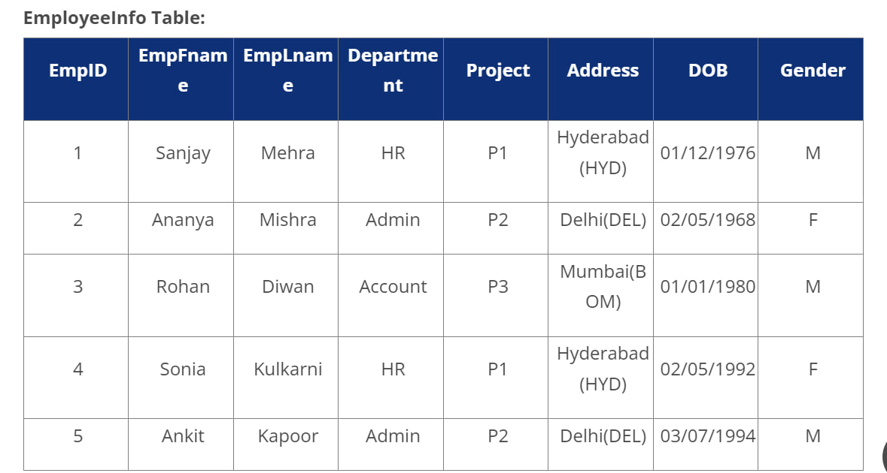
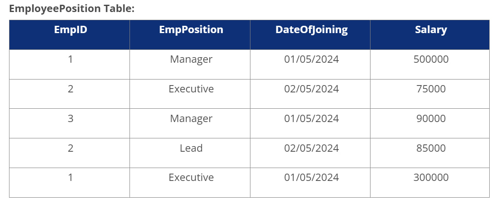
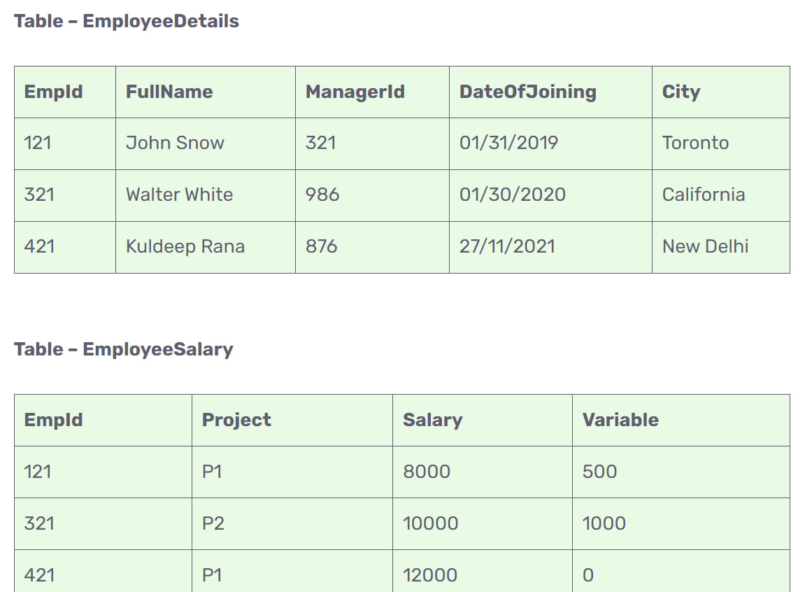
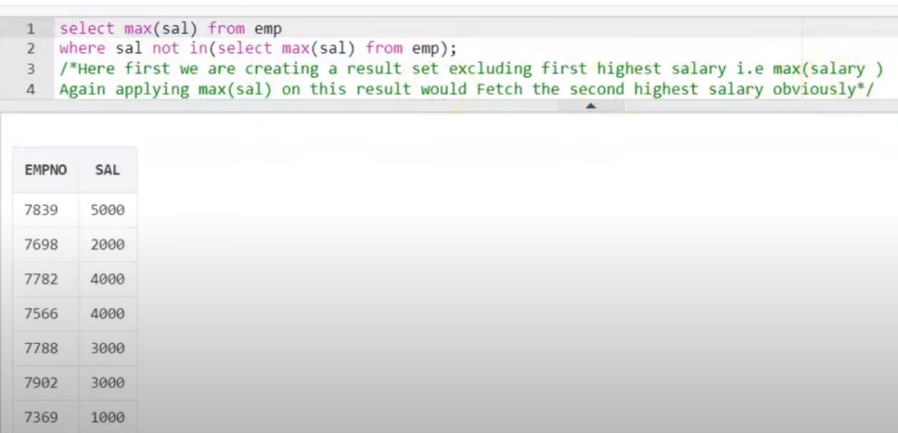
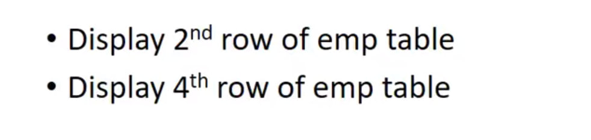
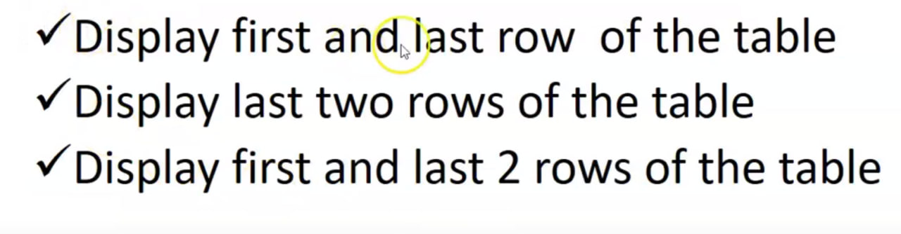

**SQL Query Interview**
---





**Q1. Write a query to get the current date.**
You can write a query as follows in SQL Server:
```sql
SELECT GETDATE();
```
You can write a query as follows in MySQL:
```sql
SELECT SYSTDATE();
```
**Q2. Write a query to retrieve the first four characters of  EmpLname from the EmployeeInfo table.**
```sql
SELECT SUBSTRING(EmpLname, 1, 4) FROM EmployeeInfo;
```
**Q3. Write a query to fetch only the place name(string before brackets) from the Address column of EmployeeInfo table.**
Using the MID function in MySQL
```sql
SELECT MID(Address, 0, LOCATE('(',Address)) FROM EmployeeInfo;
```
Using SUBSTRING
```sql
SELECT SUBSTRING(Address, 1, CHARINDEX('(',Address)) FROM EmployeeInfo;
```
**Q4. Write a query to create a new table which consists of data and structure copied from the other table.**
Using the SELECT INTO command:
```sql
SELECT * INTO NewTable FROM EmployeeInfo WHERE 1 = 0;
```
Using the CREATE command in MySQL:
```sql
CREATE TABLE NewTable AS SELECT * FROM EmployeeInfo;
```
**Q5. Write a query to fetch the EmpFname from the EmployeeInfo table in upper case and use the ALIAS name as EmpName.**
```sql
SELECT UPPER(EmpFname) AS EmpName FROM EmployeeInfo;
```
**Q6. Write a query to fetch the number of employees working in the department "HR".**
```sql
SELECT COUNT(*) FROM EmployeeInfo WHERE Department = 'HR';
```
**Q7. Write q query to find all the employees whose salary is between 50000 to 100000.**
```sql
SELECT * FROM EmployeePosition WHERE Salary BETWEEN '50000' AND '100000';
```
**Q8. Write a query to find the names of employees that begin with "S"**
```sql
SELECT * FROM EmployeeInfo WHERE EmpFname LIKE 'S%';
```
**Q9. Write a query to fetch top N records.**
By using the TOP command in SQL Server:
```sql
SELECT TOP N * FROM EmployeePosition ORDER BY Salary DESC;
```
By using the LIMIT command in MySQL:
```sql
SELECT * FROM EmpPosition ORDER BY Salary DESC LIMIT N;
```
**Q10. Write a query to retrieve the EmpFname and EmpLname in a single column as "FullName". The first name and the last name must be separated with space.**
```sql
SELECT CONCAT(EmpFname, ' ', EmpLname) AS 'FullName' FROM EmployeeInfo;
```
**Q11. Write a query find number of employees whose DOB is between 02/05/1970 to 31/12/1975 and are grouped according to gender**
```sql
SELECT COUNT(*), Gender FROM EmployeeInfo WHERE DOB BETWEEN '02/05/1970 ' AND '31/12/1975' GROUP BY Gender;
```
**Q12. Write a query to fetch all the records from the EmployeeInfo table ordered by EmpLname in descending order and Department in the ascending order.**
To order the records in ascending and descnding order, you have to use the ORDER BY statement in SQL.
```sql
SELECT * FROM EmployeeInfo ORDER BY EmpFname desc, Department asc;
```
**Q13. Write a query to fetch details of employees whose EmpLname ends with an alphabet "A" and contains five alphabets.**
To fetch details mathcing a certain value, you have to use the LIKE operator in SQL.
```sql
SELECT * FROM EmployeeInfo WHERE EmpLname LIKE '____a';
```
**Q14. Write a query to fetch details of all employees excluding the employees with first names, "Sanjay" and "Sonia" from the EmployeeInfo table.**
```sql
SELECT * FROM EmployeeInfo WHERE EmpFname NOT IN ('Sanjay','Sonia');
```
**Q15. Write a query to fetch details of employees with the address as "DELHI(DEL)".**
```sql
SELECT * FROM EmployeeInfo WHERE Address LIKE 'DELHI(DEL)%';
```
**Q16. Write a query to fetch all employees who also hold the managerial position.**
```sql
SELECT E.EmpFname, E.EmpLname, P.EmpPosition 
FROM EmployeeInfo E INNER JOIN EmployeePosition P ON
E.EmpID = P.EmpID AND P.EmpPosition IN ('Manager');
```
**Q17. Write a query to fetch the department-wise count of employees sorted by department's count in ascending order.**
```sql
SELECT Department, count(EmpID) AS EmpDeptCount 
FROM EmployeeInfo GROUP BY Department 
ORDER BY EmpDeptCount ASC;
```
**Q18. Write a query to calculate the even and odd records from a table.**
To retrieve the even records from a table, you have to use the MOD() function as follows:
```sql
SELECT EmpID FROM (SELECT rowno, EmpID from EmployeeInfo) WHERE MOD(rowno,2)=0;
```
Similarly, to retrieve the odd records from a table, you can write a query as follows:
```sql
SELECT EmpID FROM (SELECT rowno, EmpID from EmployeeInfo) WHERE MOD(rowno,2)=1;
```
**Q19. Write a SQL query to retrieve employee details from EmployeeInfo table who have a date of joining in the EmployeePosition table.**
```sql
SELECT * FROM EmployeeInfo E 
WHERE EXISTS 
(SELECT * FROM EmployeePosition P WHERE E.EmpId = P.EmpId);

SELECT *
FROM EmployeeInfo
JOIN EmployeePosition ON EmployeeInfo.EmployeeID = EmployeePosition.EmployeeID
WHERE EmployeePosition.DateOfJoining IS NOT NULL;

```
**Q20. Write a query to retrieve two minimum and maximum salaries from the EmployeePosition table.**
```sql
-- Two minimum salaries
SELECT TOP 2 Salary
FROM EmployeePosition
ORDER BY Salary;

-- Two maximum salaries
SELECT TOP 2 Salary
FROM EmployeePosition
ORDER BY Salary DESC;

--OR
--To retrieve two minimum salaries, you can write a query as below:
SELECT DISTINCT Salary FROM EmployeePosition E1 
 WHERE 2 >= (SELECTCOUNT(DISTINCT Salary)FROM EmployeePosition E2 
  WHERE E1.Salary >= E2.Salary) ORDER BY E1.Salary DESC;

--To retrieve two maximum salaries, you can write a query as below: 
SELECT DISTINCT Salary FROM EmployeePosition E1 
 WHERE 2 >= (SELECTCOUNT(DISTINCT Salary) FROM EmployeePosition E2 
  WHERE E1.Salary <= E2.Salary) ORDER BY E1.Salary DESC;
```
**Q21. Write a query to find the Nth highest salary from the table without using TOP/limit keyword.**
```sql
SELECT DISTINCT Salary
FROM EmployeePosition e1
WHERE N = (
    SELECT COUNT(DISTINCT Salary)
    FROM EmployeePosition e2
    WHERE e1.Salary <= e2.Salary);
```
**Q22. Write a query to retrieve duplicate records from a table.**
```sql
SELECT EmpID, EmpFname, Department COUNT(*) 
FROM EmployeeInfo GROUP BY EmpID, EmpFname, Department 
HAVING COUNT(*) > 1;
```
**Write a query to delete duplicate records from a table.**
```sql
WITH CTE AS (
  SELECT employee_id, employee_name,
         ROW_NUMBER() OVER (PARTITION BY employee_name ORDER BY (SELECT 0)) AS RowNum
  FROM Employee
)
DELETE FROM CTE WHERE RowNum > 1;

------OR-------
DELETE FROM Employee
WHERE (employee_name) NOT IN (
    SELECT employee_name
    FROM Employee
    GROUP BY employee_name
    HAVING COUNT(*) > 1);
```
**Q23. Write a query to retrieve the list of employees working in the same department.**
```sql
Select DISTINCT E.EmpID, E.EmpFname, E.Department 
FROM EmployeeInfo E, Employee E1 
WHERE E.Department = E1.Department AND E.EmpID != E1.EmpID;
```
**Q24. Write a query to retrieve the last 3 records from the EmployeeInfo table.**
```sql
SELECT TOP 3 *
FROM EmployeeInfo
ORDER BY EmployeeID DESC;

SELECT *
FROM EmployeeInfo
ORDER BY EmployeeID DESC
LIMIT 3;

SELECT * FROM EmployeeInfo WHERE
EmpID <=3 UNION SELECT * FROM
(SELECT * FROM EmployeeInfo E ORDER BY E.EmpID DESC) 
AS E1 WHERE E1.EmpID <=3;
```
**Q25. Write a query to find the third-highest salary from the EmpPosition table.**
```sql
SELECT TOP 1 salary
FROM(
SELECT TOP 3 salary
FROM employee_table
ORDER BY salary DESC) AS emp
ORDER BY salary ASC;
```
**Q26. Write a query to display the first and the last record from the EmployeeInfo table.**
To display the first record from the EmployeeInfo table, you can write a query as follows:
```sql
-- First Record
SELECT TOP 1 *
FROM EmployeeInfo
ORDER BY EmployeeID;

SELECT * FROM EmployeeInfo WHERE EmpID = (SELECT MIN(EmpID) FROM EmployeeInfo);
```
To display the last record from the EmployeeInfo table, you can write a query as follows:
```sql
-- Last Record
SELECT TOP 1 *
FROM EmployeeInfo
ORDER BY EmployeeID DESC;

SELECT * FROM EmployeeInfo WHERE EmpID = (SELECT MAX(EmpID) FROM EmployeeInfo);
```
**Q27. Write a query to add email validation to your database**
```sql
SELECT Email FROM EmployeeInfo WHERE NOT REGEXP_LIKE(Email, '[A-Z0-9._%+-]+@[A-Z0-9.-]+.[A-Z]{2,4}', 'i');
```
**Q28. Write a query to retrieve Departments who have less than 2 employees working in it.**
```sql
SELECT DEPARTMENT, COUNT(EmpID) as 'EmpNo' FROM EmployeeInfo GROUP BY DEPARTMENT HAVING COUNT(EmpD) < 2;
```
**Q29. Write a query to retrieve EmpPostion along with total salaries paid for each of them.**
```sql
SELECT EmpPosition, SUM(Salary) from EmployeePosition GROUP BY EmpPosition;
```
**Q30. Write a query to fetch 50% records from the EmployeeInfo table.**
```sql
SELECT TOP 50 PERCENT *
FROM EmployeeInfo
ORDER BY EmployeeID;

SELECT * 
FROM EmployeeInfo WHERE
EmpID <= (SELECT COUNT(EmpID)/2 from EmployeeInfo);
```


---



**Q1. Write an SQL query to display the total salary of each employee adding the Salary with Variable value.**
Here, we can simply use the '+' operator in SQL.
```sql
SELECT EmpId,
Salary+Variable as TotalSalary 
FROM EmployeeSalary;
```

**Q2. Write an SQL query to fetch the employees whose name begins with any two characters, followed by a text "hn" and ends with any sequence of characters.**
```sql
SELECT FullName
FROM EmployeeDetails
WHERE FullName LIKE '__hn%';
```

**Q3. Write an SQL query to fetch all the EmpIds which are present in either of the tables 'EmployeeDetails' and 'EmployeeSalary'.**
```sql
SELECT EmpId FROM EmployeeDetails
UNION 
SELECT EmpId FROM EmployeeSalary;
```

**Q4. Write an SQL query to fetch common records between two tables.**
```sql
SELECT * FROM EmployeeSalary
INTERSECT
SELECT * FROM ManagerSalary;

SELECT EmpId FROM 
EmployeeDetails 
where EmpId IN 
(SELECT EmpId FROM EmployeeSalary);

```

**Q5. Write an SQL query to fetch records that are present in one table but not in another table.**
```sql
SELECT * FROM EmployeeSalary
except
SELECT * FROM ManagerSalary;

SELECT EmpId FROM 
EmployeeDetails 
where EmpId Not IN 
(SELECT EmpId FROM EmployeeSalary);
```

**Q6. Write an SQL query to update the employee names by removing leading and trailing spaces.**
```sql
UPDATE EmployeeDetails 
SET FullName = LTRIM(RTRIM(FullName));
```
**Q7. Fetch all the employees who are not working on any project.**
```sql
SELECT EmpId 
FROM EmployeeSalary 
WHERE Project IS NULL;
```

**Q8. Write a query to fetch employee names and salary records. Display the employee details even if the salary record is not present for the employee.**
```sql
SELECT E.FullName, S.Salary 
FROM EmployeeDetails E 
LEFT JOIN 
EmployeeSalary S
ON E.EmpId = S.EmpId;
```
**Q9. Write an SQL query to fetch all the Employees who are also managers from the EmployeeDetails table.**
```sql
SELECT DISTINCT E.FullName
FROM EmployeeDetails E
INNER JOIN EmployeeDetails M
ON E.EmpID = M.ManagerID;
```
**Q10. Consider a SalesData with columns SaleID, ProductID, RegionID, SaleAmount. Write a query to find the total sales amount for each product in each region.**
```sql
SELECT ProductID, RegionID, SUM(SaleAmount) AS TotalSales 
FROM SalesData 
GROUP BY ProductID, RegionID;
```
**Q11. Write a query to find employees who earn more than their managers.**
```sql
SELECT E.Name AS EmployeeName, 
M.Name AS ManagerName, 
E.Salary AS EmployeeSalary, 
M.Salary AS ManagerSalary 
FROM EmployeeDetails E JOIN EmployeeDetails M 
ON E.ManagerID = M.EmployeeID 
WHERE E.Salary > M.Salary;
```

**Q12. Consider a StudentGrades table with columns StudentID, CourseID, Grade. Write a query to find students who have scored an 'A' in more than three courses.**
```sql
SELECT StudentID FROM StudentGrades 
WHERE Grade = 'A' 
GROUP BY StudentID 
HAVING COUNT(*) > 3;
```

**Q13. Consider a table PatientVisits with Columns VisitID, PatientID, DoctorID, VisitDate, Diagnosis.Write a query to find the latest visit date for each patient.**
```sql
SELECT PatientID, MAX(VisitDate) AS LatestVisitDate 
FROM PatientVisits 
GROUP BY PatientID;
```

**Q14. Consider a table FoodOrders with columns  OrderID, TableID, MenuItemID, OrderTime, Quantity. Write a query to find the most ordered menu item.**
```sql
SELECT TOP 1 MenuItemID, COUNT(*) AS OrderCount
FROM FoodOrders
GROUP BY MenuItemID
ORDER BY OrderCount DESC;
```
**Q15. Consider a table Transactions with columns – TransactionID, CustomerID, ProductID, TransactionDate, Amount. Write a query to find the total transaction amount for each month.**
```sql
SELECT MONTH(TransactionDate) AS Month, 
SUM(Amount) AS TotalAmount 
FROM Transactions 
GROUP BY MONTH(TransactionDate);
```
**Q16. Consider a table EmployeeAttendance with columns AttendanceID, EmployeeID, Date, Status. Write a query to find employees with more than 5 absences in a month.**
```sql
SELECT EmployeeID, 
MONTH(Date) AS Month, 
COUNT(*) AS Absences 
FROM EmployeeAttendance 
WHERE Status = 'Absent' 
GROUP BY EmployeeID, MONTH(Date) 
HAVING COUNT(*) > 5;
```

---
**Questions**

```sql
WITH RankedSalaries AS (
    SELECT Salary, ROW_NUMBER() OVER (ORDER BY Salary DESC) AS SalaryRank
    FROM Employee
)
SELECT Salary
FROM RankedSalaries
WHERE SalaryRank = 2;


SELECT TOP 1 Salary
FROM (
    SELECT DISTINCT TOP 2 Salary
    FROM Employee
    ORDER BY Salary DESC
) AS SecondHighestSalary
ORDER BY Salary ASC;
```


```sql
WITH RankedSalaries AS (
    SELECT
        FirstName,
        Salary,
        DepartmentID,
        ROW_NUMBER() OVER (PARTITION BY DepartmentID ORDER BY Salary DESC) AS SalaryRank
    FROM Employee
)
SELECT
    FirstName,
    Salary,
    DepartmentID
FROM RankedSalaries
WHERE SalaryRank = 1;


SELECT
    DepartmentID,
    MAX(Salary) AS MaxSalary
FROM Employee
GROUP BY DepartmentID;
```


```sql
WITH AlternateRecords AS (
    SELECT
        *,
        ROW_NUMBER() OVER (ORDER BY (SELECT NULL)) AS RowNum
    FROM YourTable
)
SELECT *
FROM AlternateRecords
WHERE RowNum % 2 = 1; -- Selects alternate records (odd row numbers)
```


```sql
SELECT ename, COUNT(*) AS Frequency
FROM emp
GROUP BY ename
HAVING COUNT(*) > 1; -- Filter to include only duplicated values
```

```sql
SELECT ename
FROM emp
where ename like '%N'


SELECT ename
FROM emp
where ename Not like '%N'


SELECT ename -- name contains 4 letters only
FROM emp
where ename Not like '____'


SELECT ename -- second letter is l
FROM emp
where ename Not like '_l%'
```


```sql
SELECT TOP 1 *
FROM emp
ORDER BY employee_id
OFFSET 1 ROW; --OFFSET 3 ROW


SELECT *
FROM (
    SELECT
        *,
        ROW_NUMBER() OVER (ORDER BY (SELECT NULL)) AS RowNum
    FROM emp
) AS RankedEmp
WHERE RowNum = 2; -- RowNum = 4
```


```sql
-- Display the first row
SELECT *
FROM (
    SELECT
        *,
        ROW_NUMBER() OVER (ORDER BY (SELECT NULL)) AS RowNumAsc
    FROM YourTable
) AS FirstRow
WHERE RowNumAsc = 1;

-- Display the last row
SELECT *
FROM (
    SELECT
        *,
        ROW_NUMBER() OVER (ORDER BY (SELECT NULL)) AS RowNumDesc
    FROM YourTable
) AS LastRow
WHERE RowNumDesc = (SELECT COUNT(*) FROM YourTable);


--OR
-- Display the first row
SELECT TOP 1 *
FROM YourTable
ORDER BY (SELECT NULL); -- The query you have written is used to select the first row from a table without any specific order. The SELECT NULL part is a dummy expression that does not affect the result, but is required by the syntax of the ORDER BY clause.

-- Display the last row
SELECT TOP 1 *
FROM YourTable
ORDER BY (SELECT NULL) DESC;
